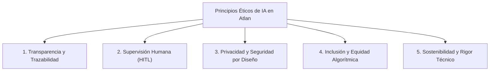
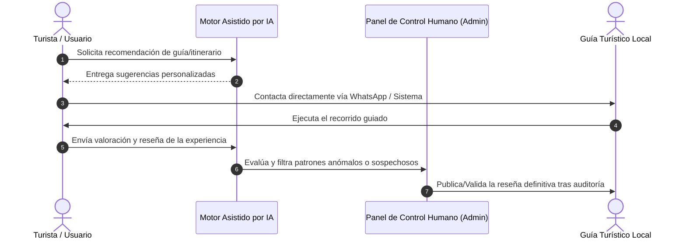

# Declaración de Uso Responsable y Gobernanza de Inteligencia Artificial
**Plataforma Atlan – Sistema Integral de Promoción Turística y Guías Locales**  
*Documento Institucional de Políticas de IA, Ética Digital y Protocolos de Seguridad de Datos*

---

## 1. Declaración de Propósito y Marco Institucional

La **Plataforma Atlan** se concibe como una infraestructura digital de vanguardia dedicada a la difusión del patrimonio cultural, natural e histórico de Nicaragua, así como al impulso socioeconómico de los guías turísticos comunitarios y la microeconomía local.

En respuesta a la evolución de las tecnologías emergentes, **Plataforma Atlan adopta e integra herramientas de Inteligencia Artificial (IA) y Aprendizaje Automático (Machine Learning)** como un medio complementario de optimización operativa, procesamiento de datos y personalización de la experiencia del turista nacional e internacional.

Esta **Declaración de Uso Responsable de IA** establece formalmente las directrices éticas, los límites técnicos, la arquitectura de implementación y los esquemas de supervisión humana que rigen el ciclo de vida de los modelos y algoritmos integrados en el ecosistema Atlan.

---

## 2. Principios Éticos Fundamentales

La implementación de Inteligencia Artificial en Plataforma Atlan se fundamenta en cinco pilares éticos no negociables:

1. **Transparencia e Identificabilidad**: Toda interacción facilitada o generada de manera asistida por algoritmos está claramente demarcada para el usuario.
2. **Supervisión Humana Obligatoria (*Human-in-the-Loop*)**: Ningún algoritmo de IA toma decisiones autónomas vinculantes sobre calificaciones de guías, suspensión de perfiles o transacciones financieras. La última palabra siempre corresponde a un administrador o auditor humano.
3. **Privacidad y Protección de Datos por Diseño**: Se prohíbe el uso de datos personales sensibles de usuarios o guías para el entrenamiento no autorizado de modelos de lenguaje públicos o externos.
4. **Inclusión, No Discriminación y Equidad**: Los algoritmos de recomendaciones promueven de forma equitativa el turismo rural, comunitario y emergente, evitando sesgos que favorezcan únicamente a centros urbanos de gran densidad.
5. **Sostenibilidad y Eficiencia Técnica**: La infraestructura algorítmica utiliza modelos optimizados de bajo consumo computacional (arquitecturas *lightweight* o de inferencia local/híbrida), reduciendo la huella de carbono digital.

---

## 3. Módulos e Implementación Funcional de la IA en Atlan

La Inteligencia Artificial dentro de Plataforma Atlan no reemplaza la calidez ni el conocimiento experto del guía local; actúa como un **asistente de infraestructura inteligente** distribuido en cuatro áreas funcionales específicas:

### 3.1. Módulo I: Motor Inteligente de Recomendación de Rutas e Itinerarios
- **Implementación**: Algoritmos de filtrado colaborativo e inferencia geoespacial que analizan preferencias expresadas por el turista (senderismo, volcanes, historia colonial, gastronomía, presupuesto) para sugerir destinos clave.
- **Contribución y Valor**: Optimiza el tiempo del visitante proponiendo recorridos lógicos y eficientes dentro de los departamentos nicaragüenses, promoviendo destinos turísticos menos visibilizados pero de alto valor cultural.

### 3.2. Módulo II: Emparejamiento Semántico (*Matching*) entre Turistas y Guías Certificados
- **Implementación**: Modelos de búsqueda vectorial y emparejamiento por proximidad geográfica, idioma nativo y especialización temática (e.g., vulcanología en Cerro Negro, avistamiento de aves en Selva Negra).
- **Contribución y Valor**: Conecta directamente al turista con el guía acreditado por INTUR más idóneo para su perfil, incrementando el nivel de satisfacción de la excursión y profesionalizando la contratación local.

### 3.3. Módulo III: Asistencia Multilingüe y Accesibilidad Internacional
- **Implementación**: Procesamiento de Lenguaje Natural (PLN) para la traducción contextual en tiempo real de descripciones de destinos, fichas de guías y materiales informativos (Español, Inglés, Francés, Alemán).
- **Contribución y Valor**: Elimina las barreras idiomáticas para el turismo internacional, garantizando que la riqueza de los relatos históricos locales sea accesible globalmente sin perder precisión cultural.

### 3.4. Módulo IV: Moderación Automatizada y Filtro Ético de Reseñas
- **Implementación**: Clasificadores de análisis de sentimiento y detección de lenguaje ofensivo, spam o ataques coordinados en el sistema de calificaciones.
- **Contribución y Valor**: Protege la reputación profesional de los guías locales frente a comentarios maliciosos o falsos, asegurando una comunidad basada en el respeto y opiniones veraces.

---

## 4. Arquitectura Técnica, Privacidad y Seguridad de Datos

La integración de capacidades de IA en Plataforma Atlan cumple estrictamente con las normativas internacionales de protección de datos personales y seguridad informática:

| Componente Técnico | Protocolo de Implementación de IA | Medida de Seguridad / Privacidad |
| :--- | :--- | :--- |
| **Almacenamiento de Datos** | Supabase (PostgreSQL) con cifrado AES-256 en reposo | Políticas Row Level Security (RLS) que restringen la visibilidad según el rol de usuario |
| **Procesamiento de IA** | Microservicios desacoplados vía API REST/gRPC en entornos aislados | Anonimización previa de datos personales antes de cualquier inferencia |
| **Modelos de Lenguaje (LLM)** | Modelos con políticas de *Zero Data Retention* (ZDR) | Garantía contractual de que los prompts no se utilizan para reentrenamiento |
| **Caché e Inferencia** | Inferencia del lado del cliente o Edge Functions | Eliminación de cookies de rastreo invasivas y cumplimiento de principios GDPR |

---

## 5. Protocolo de Gobernanza y Supervisión Humana (*Human-in-the-Loop*)

Para evitar alucinaciones algorítmicas, sesgos imprevistos o decisiones automatizadas erróneas, se establece la siguiente matriz de gobernanza:

- **Verificación de Acreditaciones**: La validación de licencias INTUR o certificaciones de guías requiere revisión documental humana obligatoria antes de otorgar el distintivo oficial.
- **Derecho a la Impugnación**: Cualquier guía o prestador de servicios que considere que una recomendación o reseña moderada fue clasificada incorrectamente puede solicitar una revisión humana prioritaria a través del panel de administración.

---

## 6. Impacto Socioeconómico y Beneficios Operativos

El uso estratégico y responsable de la Inteligencia Artificial en Atlan no es un fin en sí mismo, sino una herramienta para alcanzar los siguientes objetivos de impacto:

1. **Democratización del Oportunidades**: Visibilidad equitativa para guías independientes de todos los departamentos (León, Granada, Rivas, Matagalpa, Masaya, RACCN, RACCS, etc.).
2. **Eficiencia en la Gestión de Viajes**: Reducción del tiempo de planificación para el turista de horas a minutos mediante sugerencias estructuradas y mapas interactivos.
3. **Fomento del Turismo Sostenible**: Promoción activa de buenas prácticas ambientales y respeto por la biodiversidad nicaragüense mediante recordatorios en los itinerarios guiados.

---

## 7. Compromiso de Revisión Continua y Actualización

La tecnología de IA evoluciona de manera acelerada. Por ello, el Comité de Desarrollo y Gobernanza Digital de **Plataforma Atlan** se compromete a:

- Auditar semestralmente los algoritmos de recomendación para detectar y corregir posibles sesgos de visibilidad.
- Actualizar este documento conforme se promulguen nuevas leyes o estándares internacionales de ética en Inteligencia Artificial.
- Mantener un canal directo de soporte técnico y ético para la comunidad de guías y turistas.

---

*Última actualización: Septiembre de 2026*  
**Plataforma Atlan – Tecnología al servicio del desarrollo turístico local**
